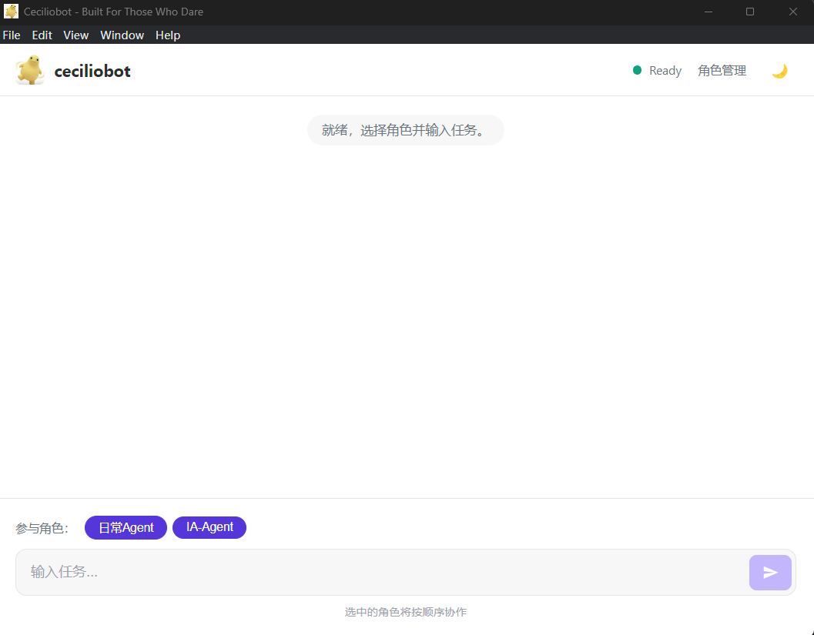
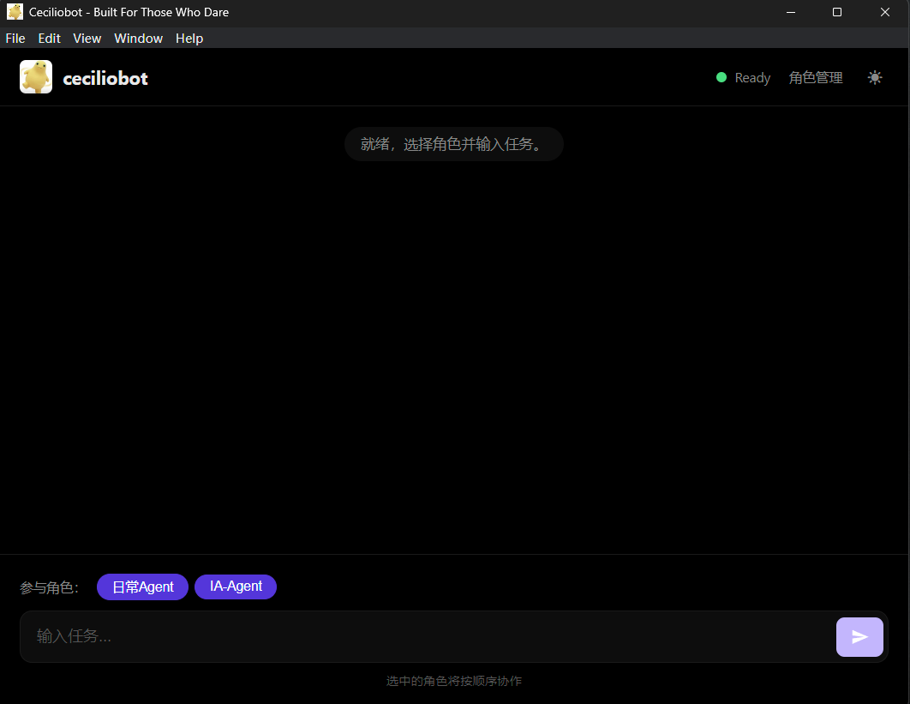
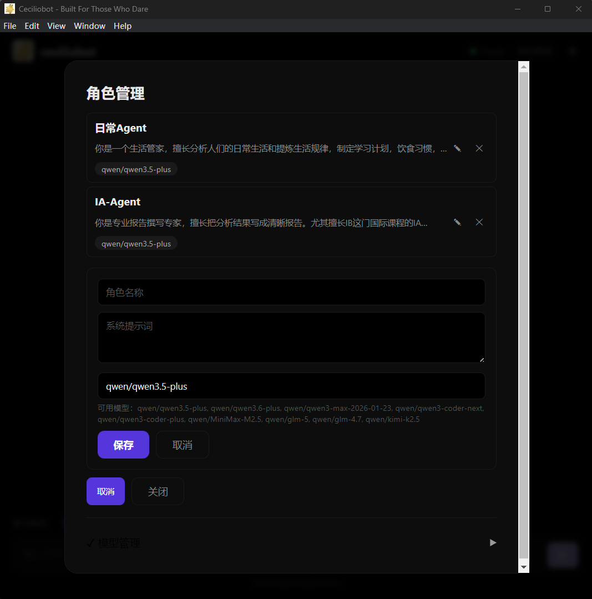
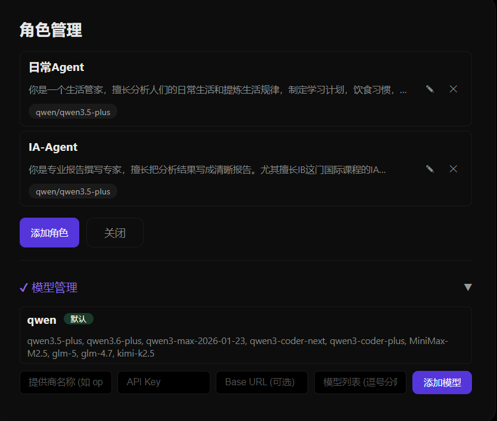

# CecilioBot

**纯对话式 AI 工作流编排工具** —— 用自然语言指挥多个 AI Agent 协作完成复杂任务。

[](https://opensource.org/licenses/MIT)
[](https://github.com)
[](https://www.electronjs.org/)
[](https://vuejs.org/)

---

## 📖 简介

ceciliobot 是一个桌面应用，让你通过**自然对话**来编排多个 AI Agent 协同工作。不需要写代码、不需要配置复杂的工作流——只需要像和人说话一样描述你的需求，剩下的交给 AI 自动完成。

**核心思想**：你说任务，AI 自动拆解、调度、执行、交付结果。

---

## 核心功能

| 功能 | 说明 |
|------|------|
| 💬 **纯对话交互** | 像现有的大语言模型一样自然对话，但背后是多 Agent 协作 |
| 🧠 **自定义角色** | 任意添加、编辑、删除 AI 角色，每个角色独立设置提示词和模型 |
| 🤖 **多模型支持** | 支持添加 OpenAI、DeepSeek 等任意兼容模型 |
| 🔗 **协作工作流** | 选择多个角色，按顺序自动接力完成任务 |
| 🚀 **一键安装** | 首次启动自动安装核心框架，无需手动配置 |
| 🔑 **OpenClaw协同** | 支持本地OpenClaw部署运营，让AI的功能不再停留在网页，实实在在的出现在你的电脑上 |

对于独立开发者：
更快交付可运行版本
写代码、做 Review、跑测试、执行部署，一条链路直接推进到可运行结果。

对于项目经理：
更快推进一个完整项目
拆任务、派角色、追进度、收结果，把项目推进从口头协调变成自动协作。

---

## 🖥️ 界面预览


| 亮色模式 | 暗色模式 |
|----------|----------|
|  |  |

---

## 🚀 快速开始

### 下载安装

从 [Releases](https://github.com/Cecilio1/CecilioBot/releases) 下载最新版本：

- `Setup.exe` — 安装版（推荐）
- `ceciliobot.exe` — 便携版（免安装）

### 首次使用

1. 双击运行 `ceciliobot.exe`，如果没有配置Openclaw环境请先运行`install.exe`
2. 输入序列号（Token）激活
3. 在「角色管理」中添加自定义角色或使用默认角色
   
5. 选择参与协作的角色，输入任务，发送
6. 添加额外的LLM API
   
   
### 从源码构建

```bash
# 克隆仓库
git clone https://github.com/Cecilio1/CecilioBot.git
cd CecilioBot

# 安装依赖
npm install
cd frontend && npm install && cd ..

# 开发模式
npm run electron:dev

